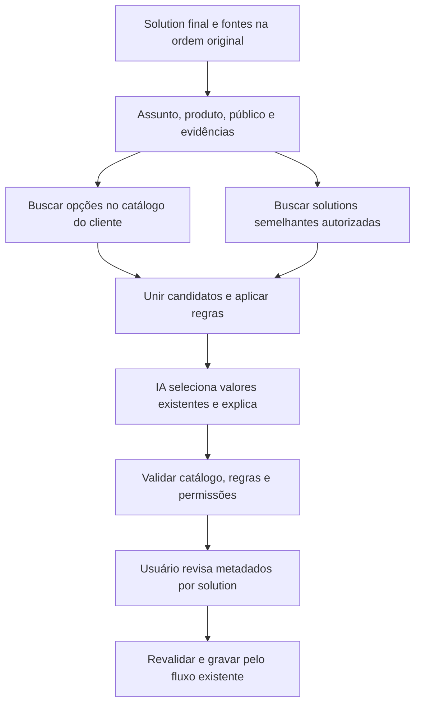

# Pesquisa: sugestão de metadados por IA

Data: 12 de setembro de 2026. Escopo: investigação de código, especificação e consultas de leitura no RightAnswers QA. Nenhuma solution foi criada ou alterada nesta pesquisa. Não foi realizado benchmark de classificação nem de escala em ambiente de cliente.

## Recomendação

Combinar recuperação de **opções do catálogo** com recuperação de **solutions semelhantes**, seguida de seleção validada por IA. O catálogo determina quais opções existem; exemplos mostram como o cliente as utiliza. Regras editoriais e permissões determinam quais opções podem ser aplicadas.

O problema é classificação hierárquica com múltiplos valores e vocabulário específico por cliente. Não basta gerar tags livres, copiar os metadados do primeiro resultado ou colocar milhares de opções no prompt.

## O produto hoje

Knowledge Studio recebe fontes, propõe novas solutions ou alterações, prepara os artigos e permite revisão antes da gravação no RightAnswers. Assim, a unidade de classificação deve ser **cada solution final**: um único conjunto de fontes pode originar artigos com assuntos e destinos diferentes.

- `app/api/metadata/route.ts` consulta templates, collections e facetas de busca. Limita taxonomias a 200 valores, sem percorrer os níveis filhos.
- `lib/autonomous/decisions.ts` envia o catálogo ao modelo e escolhe uma collection e um idioma globais para o processamento. Ainda não recomenda taxonomias individualmente por artigo.
- `lib/pipeline/execute.ts` aplica a collection global às novas solutions. Revisões preservam collections, taxonomy e idioma da solution original.
- `lib/ra/types.ts` representa collections, taxonomias e valores de atributos como listas: o desenho deve suportar múltiplos valores, sujeito às regras de cada campo/cliente.

## O que foi observado na API

Fonte de contrato: `../reference/rightanswers-openapi.json`, versão declarada `2026R1.0.0`. Consultas autenticadas no host `qa-develop.rightanswers.com`, com o contexto de usuário configurado no projeto. Os números são resultados desse contexto em QA, não inventário total do produto ou de um cliente.

| Recurso | Evidência | Implicação |
| --- | --- | --- |
| `GET /api/rest/collections` | 51 entradas, contendo `code` e `displayName`. Contrato descreve collections pesquisáveis pelo usuário da API. | Temos identidade e nome; faltam descrições de uso. Não comprova autorização de publicação. |
| `GET /api/rest/search` sem texto | `totalHits=14209`, 12 solutions na primeira página, 109 caminhos de taxonomia retornados. | Esses 109 são facetas retornadas, não o total de nós da árvore. |
| `GET /api/rest/browsepaths` | 109 entradas na raiz; `taxonomyPath=RightAnswers` retornou 16 filhos; `Linux Applications` retornou 2. | Navegação hierárquica funciona. Exemplo: `RightAnswers//API`. |
| Busca Keyword e Hybrid | Ambas responderam para `VPN` e `password`; resultados verbose incluem collections, taxonomy, atributos e status. | Podemos recuperar exemplos e metadados juntos, reduzindo consultas individuais. |
| `verboseResultFields` | Documentado e enviado nas consultas. O objeto ainda contém várias chaves do modelo completo. | Validar conteúdo e tamanho efetivamente retornados antes de depender da projeção para limitar custo. |
| `GET /api/rest/solutionsByLmd` | Documentado com intervalo de datas, limite, status e projeção de collections/taxonomy; não exercitado nesta pesquisa. | Candidato para atualização incremental de exemplos, incluindo tratamento de removidos/arquivados. |
| Catálogo administrativo completo de taxonomias e atributos | Não encontrado no contrato consultado. `/browsepaths` usa facetas e contexto de usuário. | Confirmar exportação/API administrativa para nós sem conteúdo, descrições, valores válidos e regras. Não presumir que a navegação retorna tudo. |

A busca de VPN forneceu exemplos topicamente semelhantes associados a caminhos de teste, como `0 Taxonomy//Auto1//auto-child`. Isso demonstra ruído **neste QA**, sem provar qualidade ruim em clientes. Um resultado também tinha um atributo com 1.336 valores. Precisamos limitar e selecionar valores por campo, não apenas limitar o número de solutions recuperadas.

As buscas sem filtro explícito de status retornaram também `Draft` e `Not Published`, apesar do default `approved` descrito no contrato. Uma implementação deve enviar o filtro e verificar o status retornado; não confiar só no default. Não foi validado nesta pesquisa o mapeamento completo entre filtros e nomes de status retornados.

## Arquitetura proposta

### 1. Catálogo pesquisável por cliente

Manter uma representação própria das opções, sincronizada com o RightAnswers: tipo de campo, código original, nome, caminho completo, ancestrais, idioma, descrição, sinônimos, estado ativo e versão da sincronização. Incluir regras de elegibilidade, quando disponíveis de uma fonte administrativa confiável.

Para collections, adicionar descrições editoriais administráveis: público, produto, finalidade, quando usar e quando não usar. Nomes como `Support` ou `General` não fornecem informação suficiente. Exemplos podem ajudar a sugerir uma descrição inicial, que deve ser identificada como inferida e revisada.

Para taxonomias, indexar o caminho completo: `Produto A > Administração > Usuários` tem significado diferente de `Produto B > Administração > Usuários`. Preservar o identificador nativo quando houver. O retorno observado expõe caminhos, não IDs estáveis de nós; usar chave interna e mapeamento versionado, sem assumir que um caminho permanece igual após renomeação.

O modelo de conceitos, nomes alternativos e relações hierárquicas do [W3C SKOS](https://www.w3.org/TR/skos-primer/) é uma referência útil para essa representação. Isso não exige RDF nem implica que collections do RightAnswers tenham o significado de collections no SKOS.

Sincronizar em background, com checkpoints, limites de concorrência e repetição segura. Não percorrer toda a árvore durante a criação de cada artigo. Se houver somente navegação por facetas, registrar explicitamente a cobertura parcial e buscar uma exportação administrativa para incluir categorias novas ou vazias.

### 2. Recuperar candidatos em duas frentes

**Catálogo:** busca lexical e semântica nos nomes, descrições, sinônimos e caminhos. Incluir correspondências exatas de produto/versão e explorar pais, filhos e ramos alternativos. Não descartar todos os outros ramos após uma primeira escolha incerta. Isso permite sugerir categorias novas, ainda sem solutions de exemplo.

**Solutions:** reutilizar a busca Hybrid do RightAnswers como primeira alternativa, com filtros de contexto, status e idioma apropriados. Comparar conteúdo, produto, público e tarefa; extrair metadados dos exemplos úteis. Agrupar duplicatas, traduções e revisões para que dez cópias não pareçam dez confirmações independentes. Status publicado é um filtro de qualidade inicial, não prova de classificação correta.

Unir as opções recuperadas, aplicar regras e entregar ao modelo um conjunto pequeno por campo. Ponto de partida experimental: 10–20 exemplos e 20–50 opções de taxonomia; collections e atributos com limites próprios. Esses números são hipóteses para medir, não requisitos nem resultados de desempenho. Medir o recall dos candidatos antes de fixar limites: o modelo não consegue selecionar uma opção correta que não recebeu.

O índice de catálogo deve isolar clientes e respeitar o contexto autorizado. Exemplos devem ser filtrados antes de chegar ao modelo. Um índice de serviço com acesso amplo precisa reproduzir as permissões de leitura do usuário; um cache global de exemplos sem esse controle não serve.

### 3. Decidir cada tipo de metadado de forma apropriada

| Campo | Evidência principal | Regra proposta |
| --- | --- | --- |
| Taxonomias | Conteúdo, entidades, caminho e exemplos relevantes | Selecionar um ou mais caminhos existentes; respeitar se o cliente permite marcar pais, folhas ou ambos. |
| Collections | Público, finalidade, instruções do autor, regras de destino e exemplos | Validar elegibilidade de publicação separadamente da visibilidade em busca. Pedir decisão humana quando o conteúdo não revela o público. |
| Atributos controlados | Definição do atributo, valores permitidos e evidência específica | Escolher dentro do conjunto correto, validando tipo e cardinalidade. Não inferir milhares de códigos a partir de um vizinho. |
| Idioma e keywords | Texto final e regras editoriais | Idioma validado contra valores suportados; keywords livres somente quando o campo permitir. |
| Template | Estrutura e finalidade da solution | Decidir antes da composição quando necessário; revisar metadados dependentes após o texto final. |

A seleção deve devolver referências exatas às opções recuperadas, justificativa curta, evidências da solution, IDs de exemplos úteis e eventuais ambiguidades. O servidor resolve referências para códigos/caminhos nativos e rejeita valores desconhecidos ou incompatíveis. Não criar categorias automaticamente nesta primeira versão.

O conteúdo recuperado e as fontes são dados, não instruções para contornar regras. As imagens originais e a ordem entre texto e imagens continuam disponíveis ao modelo quando necessárias à interpretação. O artigo final é a base da classificação; o material de entrada pode conter assuntos que não fazem parte daquele artigo.

Permitir abstenção: “não há evidência suficiente para escolher entre estas duas collections”. Não mostrar percentuais de confiança gerados livremente pelo modelo como probabilidades medidas.

### 4. Experiência no Knowledge Studio

Adicionar sugestões na revisão de metadados de **cada solution**, após a preparação do texto. Mostrar caminho completo da taxonomia e nome legível da collection, com seleção múltipla quando permitida. Uma explicação expansível apresenta o trecho que motivou a sugestão e links de exemplos acessíveis ao usuário.

O usuário pode aceitar, remover, substituir ou buscar outras opções por autocomplete e navegação hierárquica. Não carregar milhares de itens em um dropdown. Diferenciar valor atual, sugestão e alteração aprovada. Uma edição manual não deve ser sobrescrita silenciosamente por nova sugestão.

Em revisões, apresentar diferenças de metadados e preservar os atuais até que uma alteração seja aprovada. Uma opção explícita de aplicar a várias solutions pode economizar trabalho, mas não deve impor a mesma classificação a artigos de assuntos diferentes. Alterações no conteúdo após a sugestão devem marcá-la para reavaliação.

Antes da gravação, revalidar versão do conteúdo, existência das opções e autorização. O adaptador atual `ra.updateSolution` documenta um comportamento relevante: enviar collections em atualização direta junto de `minorSave` pode criar outro registro. O fluxo de alteração de metadados precisa de teste de integração específico antes de ser habilitado; esta pesquisa não testou escrita.

## Escala e atualização

Milhares de opções exigem recuperação e limites de contexto; não exigem, por si só, treinar um modelo por cliente. Começar sem fine-tuning. Separar índice de opções, índice/evidência de artigos e decisão por IA permite atualizar o catálogo sem retreinar o classificador.

Reutilizar a busca de solutions existente evita duplicar imediatamente toda a base. Para o catálogo, medir busca lexical e vetorial sobre o volume real antes de escolher nova infraestrutura. Orçar tokens por campo e tamanho de evidências, inclusive atributos muito grandes. Não há estimativa validada de custo ou latência nesta pesquisa.

O contrato de `solutionsByLmd` oferece um caminho para sincronização incremental, mas limites, empates de timestamp, timezone e exclusões precisam ser verificados. Usar janelas sobrepostas com deduplicação e reconciliação periódica. Alterações de catálogo/permissões precisam de atualização própria: modificar uma categoria pode não atualizar a data de todas as solutions afetadas.

## Como validar a proposta

Pilotar sugestões com revisão humana em uma amostra inicial de 200–500 solutions curadas de um cliente, ampliando-a para cobrir categorias raras e hierarquias relevantes. Essa amostra inicial não valida milhares de classes sozinha.

Comparar três estratégias no mesmo conjunto: somente vizinhos, somente catálogo e combinação. Separar treino/exemplos e avaliação por famílias de artigos e revisões para evitar vazamento. Incluir categorias novas, nomes ambíguos, múltiplos rótulos, conteúdo sem boa correspondência e diferentes públicos/permissões. A classificação histórica deve ser revisada por especialistas; não tratá-la automaticamente como verdade.

Medir por campo: recall da recuperação de candidatos, precisão/recall das sugestões, acerto por caminho completo e hierárquico, resultado em classes raras, taxa de aceitação/edição, abstenções, tempo economizado, tokens e latência. Avaliar separadamente erros de destino de collection. Calibrar eventual automação pela precisão observada e cobertura, não por autoconfiança do modelo.

Registrar feedback junto da versão do catálogo, conteúdo e evidências. Apenas decisões humanas revisadas devem alimentar exemplos de referência; sugestões aceitas mecanicamente podem perpetuar erros.

## Próximo incremento recomendado

Construir um protótipo de recomendação sem escrita, com catálogo navegável e sugestões por solution. Antes de prometer cobertura completa, confirmar com o backend do RightAnswers: acesso a nós sem hits, IDs estáveis/renomeações, definições de atributos, cardinalidades, regras entre campos e permissões de publicação. Depois comparar as três estratégias com especialistas do cliente e integrar as sugestões à revisão do Knowledge Studio.

Este documento propõe a arquitetura e registra viabilidade das leituras testadas. A qualidade da classificação, o catálogo completo e a gravação de alterações de metadados permanecem por validar.
