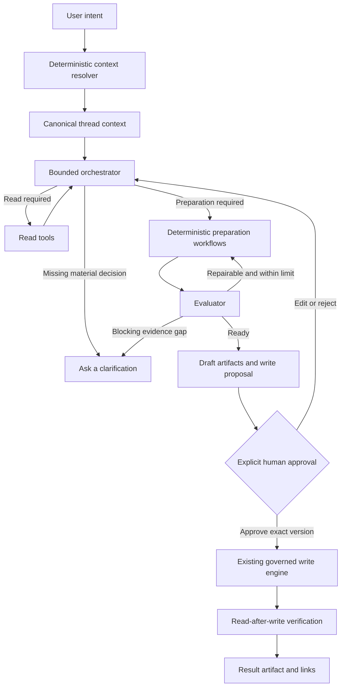

# AI Workspace agentic pilot

Status: proposed architecture and atomic implementation plan  
Working name: **AI Workspace**  
Last updated: 2026-09-19

## 1. Executive summary

AI Workspace is a new, complementary product surface in the application sidebar. It does not replace Knowledge Studio and is not a redesign of the production AI Knowledge Assistant. It addresses a different class of work: ambiguous, conversational and multi-step knowledge-management requests that users currently take to general-purpose products such as Microsoft Copilot.

The target experience is:

1. The author selects one RightAnswers customer connection.
2. The author states a goal in natural language and attaches standards, files, URLs or explicit solution IDs.
3. The application deterministically resolves explicit context, such as pinned solution IDs.
4. A bounded agent plans the work and selects approved read or preparation tools when the next steps are not predetermined.
5. The agent searches and reads the knowledge base, produces one or more solution drafts, evaluates them against the supplied standards and repairs bounded quality failures.
6. The application presents the proposed solutions, evidence, conflicts, metadata and intended KB actions. No KB write has happened yet.
7. The author explicitly approves an immutable write proposal in the UI.
8. The existing governed write engine creates review drafts or revisions, verifies the results and returns links to the created solutions.

The architecture is deliberately hybrid. The model is free to interpret the request, plan and select low-risk tools, but the application remains authoritative for identity, customer scope, permissions, validation, approval, idempotency and writes. This is similar in class to modern Copilot-style generative orchestration, but specialized for RightAnswers and bounded more tightly than a general-purpose assistant.

The British Gas authoring request is the pilot benchmark. The goal is scoped parity for knowledge-authoring workflows, not universal parity with Microsoft Copilot.

## 2. Product position

### 2.1 The three product surfaces

| Surface | Primary job | Interaction model | Control model |
| --- | --- | --- | --- |
| AI Knowledge Assistant | Lightweight production AI assistance | Short, task-specific interaction | Existing production behavior; outside the scope of this document |
| Knowledge Studio | Repeatable content transformation and governed KB workflows | Guided steps and explicit options | Deterministic workflow with optional bounded autonomous execution |
| AI Workspace | Open-ended knowledge work that may require discovery, planning and several artifacts | Persistent conversation plus an artifact workspace | Generative planning and reads; deterministic approval and writes |

AI Workspace must be a new sidebar item. It must not be hidden behind the autonomous switch in Knowledge Studio, and it must not change the default Knowledge Studio journey.

Recommended sidebar entry:

- Label: `AI Workspace`
- Icon: `forum` or `smart_toy`
- Description: `Ask, prepare, and act in the KB`
- Route: `/ai-workspace`

### 2.2 What success means

For a request such as the British Gas example, an author should be able to:

- select the British Gas RightAnswers connection;
- attach the authoring prompt, content principles, tone guidance and sample material;
- pin one or more existing solution IDs;
- ask for a review, transformation or set of single-intent articles;
- let the agent retrieve additional relevant solutions when useful;
- inspect the proposed articles and every unresolved conflict;
- edit individual drafts;
- approve the exact set of intended creates or revisions;
- receive the resulting RightAnswers solution IDs and links without leaving the application.

### 2.3 What it is not

The pilot is not:

- a replacement for Knowledge Studio;
- an unrestricted autonomous agent;
- a general web research assistant;
- an agent that can publish, delete or archive content;
- a second RightAnswers write implementation;
- a multi-agent platform;
- an MCP server project;
- a promise of parity with every Microsoft Copilot capability.

## 3. Why a new architecture is needed

Knowledge Studio already contains strong governance and content-processing capabilities, but its contract is a workflow contract. The user provides content, chooses operations and receives a plan. Even autonomous mode follows a known sequence of analysis, decision, preparation, review and submission.

The current LLM entry point reinforces that boundary:

- source content is isolated as untrusted data;
- the application supplies the trusted task;
- every operation produces structured output;
- the application, not the model, selects the operation sequence.

Those properties are correct for Knowledge Studio. They become a limitation when a user expects a Copilot-like request to be interpreted as an instruction. AI Workspace therefore needs two first-class channels that must never be conflated:

1. **Operator intent**: trusted as the user's requested task, still constrained by product policy.
2. **Evidence and context**: files, URLs, solution content, tool results and standards that remain untrusted data.

This separation is the most important architectural requirement. A British Gas prompt placed in the intent channel must guide the work. The same text found inside an uploaded solution or document must not become an instruction to the agent.

## 4. Research findings and adopted patterns

### 4.1 Workflows and agents are different

Anthropic distinguishes workflows, where code determines the path, from agents, where the model dynamically directs tool use. It recommends beginning with simple, composable patterns and accepting additional latency and cost only where flexibility produces value. The same guidance identifies prompt chaining, orchestrator–worker and evaluator–optimizer as useful production patterns. See [Building effective agents](https://www.anthropic.com/engineering/building-effective-agents).

Adoption decision:

- Retain deterministic workflows for known preparation and write operations.
- Add a model-directed loop only for interpreting the request, retrieving evidence and deciding which bounded preparation capabilities are necessary.
- Use evaluator–optimizer for authored content because British Gas provides explicit evaluation criteria and iterative refinement has measurable value.
- Do not introduce a general agent framework or multi-agent system for the pilot.

### 4.2 Copilot-style orchestration is hybrid

Microsoft describes generative orchestration as an LLM-driven planning layer that decomposes requests, selects tools and knowledge, and executes multistep plans. Its production guidance separates three control layers: generative behavior for low-risk work, hybrid interception for work requiring checkpoints, and deterministic handling for critical or irreversible actions. It also recommends small, well-described tools and explicit approval boundaries. See [Microsoft Copilot Studio generative orchestration](https://learn.microsoft.com/en-us/microsoft-copilot-studio/guidance/generative-orchestration).

Adoption decision:

- Use a generative planner for read-only discovery and content preparation.
- Insert an application-owned checkpoint before every RightAnswers mutation.
- Never rely on prompt instructions alone to protect write actions.
- Keep tool names, descriptions, parameters and outputs narrow and unambiguous.

### 4.3 Tool calling is a protocol, not the whole agent

The OpenAI Responses API supports custom function tools, JSON-typed arguments, automatic or constrained tool selection, parallel calls, conversation linkage and tool-call limits. See the [official OpenAI Responses API documentation](https://developers.openai.com/api/reference/cli/resources/responses/methods/create).

Tool calling alone does not provide planning, authorization, durability or quality. The application still needs an execution harness that:

- supplies only tools allowed for the current state;
- validates every argument;
- executes tools under the authenticated actor and selected customer;
- records the result;
- returns the result to the model;
- stops on completion, clarification, approval, budget or error;
- prevents the model from invoking side effects directly.

### 4.4 ReAct is useful, but private reasoning is not a product artifact

The ReAct pattern interleaves model decisions and environment actions so the model can revise its plan after observing tool results. The original paper reports benefits from grounding reasoning in external observations. See [ReAct: Synergizing Reasoning and Acting in Language Models](https://arxiv.org/abs/2210.03629).

Adoption decision:

- Implement the observable loop `decide → call tool → observe result → decide`.
- Persist tool calls, concise decision explanations and outcomes.
- Do not request, expose or store private chain-of-thought.
- Treat the model's plan as proposed control data, not authorization.

### 4.5 Tools require strong host boundaries

MCP's host/client/server architecture assigns context aggregation, consent and authorization to the host while giving servers only the context needed for their capability. See the [Model Context Protocol architecture](https://modelcontextprotocol.io/specification/2025-03-26/architecture/index).

Adoption decision:

- Apply the host security principles internally even without adopting MCP in the pilot.
- The AI Workspace server is the host and policy enforcement point.
- Tool handlers receive a minimal `AgentToolContext`, not the whole conversation or raw credentials.
- RightAnswers tokens never enter prompts, tool results, events or browser state.
- Design the internal tool registry so it can later be exposed through MCP if there is a real interoperability requirement.

MCP is not recommended for the first pilot because all required tools are local application functions, the existing TypeScript client already has the correct actor/connection context, and another transport/authentication boundary would add risk without improving the British Gas outcome.

### 4.6 Excessive agency is a concrete security failure

OWASP identifies excessive functionality, permissions and autonomy as the root causes of damaging agent actions, including performing high-impact changes without independent confirmation. See [OWASP LLM08: Excessive Agency](https://genai.owasp.org/llmrisk2023-24/llm08-excessive-agency/).

Adoption decision:

- Do not expose publish, delete or archive functions.
- Do not expose a generic HTTP function.
- Do not give the planner a direct `manageSolution` tool.
- Bind every tool call to the current actor and a single selected connection.
- Represent write intent as a pending approval artifact.
- Execute approved writes through the existing server-side write engine only.

### 4.7 Agent evals must grade the trajectory and final state

Agent behavior spans multiple turns and tool calls, so final-answer grading is insufficient. Effective evaluation records the transcript/trajectory and checks the resulting environment state. See [Demystifying evals for AI agents](https://www.anthropic.com/engineering/demystifying-evals-for-ai-agents).

Adoption decision:

- Grade both content quality and tool behavior.
- Run several trials for probabilistic scenarios.
- Check actual persisted artifacts and mocked KB state, not only the final chat message.
- Make the British Gas corpus a versioned regression suite before pilot release.

## 5. Architectural principles

1. **Complement, do not fork.** AI Workspace reuses existing ingestion, authoring, Ground Context, metadata, write, audit and recovery logic.
2. **Intent is not evidence.** User instructions and untrusted source material are distinct types throughout storage, prompting and UI.
3. **One customer per thread.** A thread is permanently bound to one RightAnswers connection after its first context item or tool call.
4. **Read broadly, write narrowly.** Read tools may be model-selected within limits. Mutations are not model-executable.
5. **Approval is an object, not a phrase.** A chat response such as “yes” can open an approval card, but only an authenticated approval endpoint can authorize execution.
6. **The approved payload is immutable.** Editing a draft, destination or metadata invalidates its approval.
7. **Use the existing write engine.** Review drafts, revisions, idempotency, source freshness, uncertain outcomes and audit retain one implementation.
8. **Bound every loop.** Turns have maximum model calls, tool calls, evaluator rounds, elapsed time, tokens and cost.
9. **Evidence before confidence.** Claims about source content, conflicts and standards carry source references.
10. **No silent partial success.** The UI distinguishes prepared, approved, created, revised, skipped, failed and uncertain results.
11. **Application-owned state is canonical.** Provider conversation state may optimize execution later but is not the source of truth.
12. **Start with one orchestrator.** Specialist subagents are deferred until evals demonstrate that a single bounded orchestrator cannot meet the benchmark.

## 6. Target user experience

### 6.1 Layout

Desktop uses three coordinated regions:

- **Conversation list and customer identity**: threads, selected RightAnswers customer and status.
- **Conversation**: user messages, concise agent messages, clarification questions and activity summaries.
- **Context and artifacts**: pinned sources, standards, proposed solutions, evaluation reports, conflicts and approval cards.

On narrower screens, context and artifacts become drawers reachable from persistent buttons. The chat must never be the only place where a proposed solution can be inspected.

### 6.2 New thread

The new-thread screen requires a RightAnswers customer selection. It uses the existing saved connections and default connection. Once the user adds context or sends a message, the customer is locked for the thread. To use another customer, create a new thread.

This prevents a conversation from retrieving evidence from one tenant and writing to another.

### 6.3 Adding context

The composer supports:

- plain-language instruction;
- files already accepted by the ingestion service;
- URLs through the existing SSRF-protected fetch path;
- solution search and selection;
- direct 15-digit solution IDs;
- Ground Context references;
- a named standards pack created from uploaded customer guidance.

Explicitly added IDs and selected search results are resolved by application code before the first model decision. The model does not need to infer whether an explicit solution ID should be fetched.

Context items show:

- stable source ID;
- customer connection;
- title/type;
- retrieval state;
- source version or content fingerprint;
- whether it is a processing target, supporting evidence or standards material.

### 6.4 During execution

The author sees user-facing activity, for example:

- Reading solution 123456789012345
- Searching for related Warm Home Discount articles
- Preparing 11 proposed solutions
- Checking the drafts against 17 British Gas rules
- Revising 3 drafts that missed required guidance

The activity view can expose tool name, validated input, duration, status and summarized output. It must not expose hidden reasoning, credentials or full sensitive payloads by default.

### 6.5 Proposed solutions

The agent's response links to durable artifacts. A solution-set artifact displays:

- total proposed creates and revisions;
- title, summary, keywords and template;
- fields in template order;
- proposed collection, language and taxonomy;
- source contribution map;
- standards results;
- conflicts and open questions;
- duplicate warnings;
- proposed destination for revisions or merges;
- editable content;
- current validation state.

No label may imply that a proposed solution already exists in RightAnswers.

### 6.6 Approval

When all selected drafts are valid, the assistant may say:

> I prepared 11 proposed solutions. Five source conflicts remain visible as content-owner notices. No RightAnswers content has been created. Review the drafts and approve the exact write set when ready.

The approval card includes:

- selected customer and base URL;
- number of creates and revisions;
- every destination ID;
- immutable payload hash/version;
- warnings and unresolved non-blocking notices;
- estimated action list;
- `Create review drafts` and `Cancel` controls.

Blocking conflicts disable approval. Editing any approved field returns the proposal to `draft` and requires a new approval.

### 6.7 Results

After execution, show each real outcome:

- created review draft with ID/link;
- created revision with parent and revision ID/link;
- skipped because a source changed;
- failed with actionable error;
- uncertain, requiring RightAnswers reconciliation.

The chat summarizes these outcomes but the results artifact is authoritative.

## 7. Bounded orchestration model

### 7.1 High-level flow



### 7.2 Turn state machine

Each user turn moves through explicit states:

```text
queued
  → resolving_context
  → planning
  → calling_tools ↔ planning
  → preparing_artifacts
  → evaluating ↔ repairing
  → awaiting_user | awaiting_approval | completed | failed
```

Write execution is a separate state machine:

```text
pending
  → approved
  → executing
  → succeeded | partial | failed | uncertain | expired | cancelled
```

A model response cannot directly transition a write proposal from `pending` to `approved`.

### 7.3 Stop conditions

Pilot defaults per turn:

- maximum 6 orchestration model calls;
- maximum 12 model-selected tool calls;
- maximum 2 evaluator repair rounds per artifact;
- maximum 40 proposed solutions, retaining the current pipeline ceiling;
- maximum 20 explicit source solutions;
- existing 500,000-character source limit;
- maximum 5 minutes per server request;
- configurable token and USD budget;
- stop immediately on lost customer binding, authorization failure or invalid tool output.

When a limit is reached, persist the partial artifacts and ask the user to narrow or continue the task. Do not silently truncate the plan.

### 7.4 When the agent asks a question

Ask only when the missing answer materially changes scope or creates unsafe ambiguity, for example:

- the requested destination is not identifiable;
- two standards conflict and neither is declared authoritative;
- the user requests updating an article but no target can be established;
- an essential factual answer is absent from all supplied evidence;
- multiple customer connections could apply before a thread is bound.

Do not ask for details that can be obtained safely through read tools.

## 8. Tool architecture

### 8.1 Tool registry

Create an application-owned registry. Each definition contains:

```ts
type AgentToolDefinition<I, O> = {
  name: string;
  description: string;
  inputSchema: ZodType<I>;
  outputSchema: ZodType<O>;
  risk: "read" | "prepare" | "approval-request";
  parallelSafe: boolean;
  cachePolicy: "turn" | "thread" | "none";
  timeoutMs: number;
  execute(input: I, context: AgentToolContext): Promise<O>;
};
```

`AgentToolContext` contains only:

- actor;
- thread ID and run ID;
- resolved RightAnswers connection object;
- abort signal;
- event/audit writer;
- allowed context and artifact accessors.

It never contains raw browser-provided credentials or an unvalidated arbitrary base URL.

### 8.2 Pilot tool set

Keep the model-visible toolkit deliberately small.

#### `search_solutions`

Purpose: search the selected RightAnswers tenant for relevant content.

Inputs:

- query;
- optional collection, language, taxonomy and status filters;
- requested limit within a server-enforced ceiling.

Outputs:

- solution ID;
- title;
- summary/snippet;
- status/template;
- retrieval metadata.

Policy: read-only, auto-call allowed. The server forces `loggingEnabled=false` and validates filters against the selected customer catalog.

#### `get_solutions`

Purpose: retrieve full content for one or more known IDs.

Inputs: unique 15-digit IDs, bounded batch size.  
Outputs: source snapshots with fields, metadata, status, updated value and fingerprint.  
Policy: read-only, auto-call allowed; actor permissions and customer binding enforced.

#### `get_kb_catalog`

Purpose: retrieve available templates, collections, languages and browse paths needed for a plan.

Policy: read-only and cached for the thread with freshness metadata.

#### `inspect_workspace_context`

Purpose: obtain structured summaries and IDs of already attached files, standards and artifacts without resending every full body to every call.

Policy: application-local read.

#### `prepare_solution_set`

Purpose: invoke existing deterministic Knowledge Studio operations to split, choose templates, restructure, apply standards, assess duplicates and build prepared solution artifacts.

Inputs reference canonical context IDs and a structured brief; they do not repeat arbitrary document bodies.  
Outputs are durable draft artifact IDs and validation summaries.  
Policy: no RightAnswers writes. Auto-call allowed when the user requested content generation or transformation.

#### `evaluate_solution_set`

Purpose: evaluate drafts against a versioned rubric, source evidence and standards pack.

Outputs:

- pass/fail per criterion;
- evidence references;
- blocking conflicts;
- repair instructions;
- aggregate readiness.

Policy: no writes; at most two repair rounds.

#### `request_kb_write`

Purpose: create a pending approval artifact from selected, valid draft versions.

This tool does not call RightAnswers. It returns the approval ID and UI summary. The actual write executor is not a model tool.

### 8.3 Tools intentionally not exposed

- raw `manageSolution`;
- raw HTTP requests;
- publish solution;
- delete/archive solution;
- change credentials or customer connection;
- run arbitrary SQL or code;
- unrestricted web search;
- replay a failed POST;
- force an approval status.

### 8.4 Deterministic commands and arguments

The UI may support commands such as:

- `/solution 123456789012345`
- `/search warm home discount voucher`
- `/standards British Gas authoring`
- `/compare 123456789012345 987654321098765`

These are application commands, not prompts. The parser validates them and updates context or executes the corresponding safe read. The model receives the resolved context afterward.

Buttons and structured UI selections use the same deterministic path. Free text can still cause the model to select an equivalent read tool when no explicit command is present.

## 9. Prompt and context architecture

### 9.1 Trusted layers

The orchestrator request has four distinct layers:

1. **System policy**: immutable product identity, tool policy, stopping rules and non-negotiable safety boundaries.
2. **Developer task contract**: how to plan, cite sources, create artifacts, ask questions and request approval.
3. **Operator intent**: the authenticated user's current request and prior explicit decisions.
4. **Untrusted evidence**: solution content, files, URLs, standards bodies and tool outputs.

Operator intent is allowed to direct the task but cannot expand permissions. Evidence can support content but cannot direct behavior or tool use.

### 9.2 Canonical context, not unlimited chat replay

The application stores the full thread, but each model call receives a compiled context:

- current request;
- active user decisions;
- bounded recent conversational messages;
- durable summaries of earlier turns;
- source/artifact index;
- only the full evidence required for the current step;
- tool results relevant to the next decision.

This avoids blindly replaying an ever-growing transcript and makes source inclusion auditable.

### 9.3 Provider state

The canonical thread remains in the application database. The pilot should use application-managed input and `store: false` unless data-governance review explicitly approves provider-managed conversation retention. Provider response IDs may be retained only when policy permits and must never be required to resume a thread.

The OpenAI documentation notes that stored responses and conversation linkage are available, but application-owned state is better aligned with existing run recovery, Turso persistence and audit requirements.

### 9.4 Prompt injection treatment

Reuse the existing nonce-delimited untrusted-content mechanism and extend it to every tool result. Additional rules:

- tool descriptions exist only in trusted configuration;
- a source cannot request tools;
- source text that resembles an approval is inert;
- retrieved HTML is sanitized before display;
- the selected customer and tool allowlist are not model-editable;
- unexpected instructions in sources are included in security telemetry;
- write proposals cite canonical artifact IDs, never content-provided IDs.

## 10. Artifact model

Chat messages are not sufficient for long-lived knowledge work. Store outputs as versioned artifacts.

Pilot artifact kinds:

- `work_plan`
- `standards_pack`
- `solution_set`
- `solution_draft`
- `comparison_report`
- `standards_report`
- `conflict_report`
- `write_proposal`
- `write_result`

Every artifact has:

- stable ID;
- thread and producing run;
- kind;
- version;
- status;
- structured payload;
- source reference IDs and fingerprints;
- parent artifact/version when revised;
- created/updated timestamps;
- content hash.

Draft edits create a new artifact version. Older versions remain available to the audit trail. Only the current valid version can enter a write proposal.

## 11. Data model

Additive tables are preferred, consistent with the current schema strategy.

### 11.1 `agent_threads`

```sql
id TEXT PRIMARY KEY
owner TEXT NOT NULL
title TEXT NOT NULL
connection_id TEXT NOT NULL
status TEXT NOT NULL
created_at TEXT NOT NULL
updated_at TEXT NOT NULL
```

Status: `active | archived`.

### 11.2 `agent_messages`

```sql
id TEXT PRIMARY KEY
thread_id TEXT NOT NULL
role TEXT NOT NULL
kind TEXT NOT NULL
content TEXT NOT NULL
created_at TEXT NOT NULL
```

Role: `user | assistant | system-event`.  
Kind: `text | clarification | activity-summary | approval-summary | result-summary`.

Do not store hidden reasoning.

### 11.3 `agent_context_items`

```sql
id TEXT PRIMARY KEY
thread_id TEXT NOT NULL
kind TEXT NOT NULL
role TEXT NOT NULL
external_id TEXT
title TEXT NOT NULL
payload TEXT NOT NULL
fingerprint TEXT NOT NULL
created_at TEXT NOT NULL
updated_at TEXT NOT NULL
```

Kind: `solution | file | url | text | standards-pack | ground-reference`.  
Role: `target | evidence | standard`.

### 11.4 `agent_runs`

```sql
id TEXT PRIMARY KEY
thread_id TEXT NOT NULL
trigger_message_id TEXT NOT NULL
base_run_id TEXT NOT NULL
status TEXT NOT NULL
stage TEXT NOT NULL
budget TEXT NOT NULL
lease_token TEXT
lease_until INTEGER NOT NULL DEFAULT 0
error TEXT
created_at TEXT NOT NULL
updated_at TEXT NOT NULL
```

`base_run_id` links the conversational run to an ordinary `runs` record so existing AI audit, source snapshots, connection binding, execution plans and write state can be reused.

### 11.5 `agent_events`

Use the shape of `autonomous_events`: stage, kind, name, status, explanation, safe input/output and correlation ID. Add `tool_call_id` and artifact references where applicable.

### 11.6 `agent_tool_calls`

```sql
id TEXT PRIMARY KEY
run_id TEXT NOT NULL
provider_call_id TEXT
tool_name TEXT NOT NULL
risk TEXT NOT NULL
arguments TEXT NOT NULL
result TEXT
status TEXT NOT NULL
started_at TEXT NOT NULL
completed_at TEXT
```

Validated arguments, not raw model text, are stored. Secrets and authorization headers are never stored.

### 11.7 `agent_artifacts` and `agent_artifact_versions`

The current pointer and immutable version bodies are separate so edits can invalidate approvals without losing history.

### 11.8 `agent_approvals`

```sql
id TEXT PRIMARY KEY
thread_id TEXT NOT NULL
run_id TEXT NOT NULL
artifact_id TEXT NOT NULL
artifact_version INTEGER NOT NULL
payload_hash TEXT NOT NULL
actor TEXT NOT NULL
status TEXT NOT NULL
approved_at TEXT
executed_at TEXT
expires_at TEXT NOT NULL
result_artifact_id TEXT
```

Status: `pending | approved | executing | succeeded | partial | failed | uncertain | cancelled | expired | invalidated`.

The server recomputes the payload hash and checks the current actor, customer, source versions and prepared versions before execution.

## 12. Integration with the existing codebase

### 12.1 Capabilities to reuse

| Existing capability | Reuse in AI Workspace |
| --- | --- |
| Saved RightAnswers connections | Bind one connection to each thread and run |
| `withRaConnection` and `ra` client | Execute every KB read/write under current actor and customer |
| Ingestion and image store | Attach files, URLs and ordered visual sources |
| Ground Context snapshot/version checks | Represent reference-only KB evidence |
| `splitTopics`, `restructure`, `mergeSections`, `applyStandards` | Implement preparation workflows behind tools |
| Metadata research/validation | Propose and validate destinations |
| `buildWritePlan` / `WriteOp` | Produce the canonical list of KB actions |
| `PreparedContent` and `write_state` | Persist exact reviewable solution versions |
| `executeWritePlan` | Create review drafts and revisions |
| write audit and idempotency keys | Prevent duplicate writes and show real outcomes |
| run locks, leases and checkpoints | Resume bounded conversational work safely |
| AI audit and telemetry | Trace models, tools, tokens, cost and outcomes |
| Submission graph/artifact previews | Visualize proposed and actual results |

### 12.2 Required refactors

Avoid copying pipeline internals into `lib/agent`.

1. Extract preparation of a `WriteOp` into a reusable service that returns/persists `PreparedContent` without assuming the guided route or autonomous runner.
2. Extract write execution authorization from UI-specific request shapes so both Knowledge Studio and AI Workspace can call the same validated executor.
3. Generalize telemetry context from autonomous-only storage to a small adapter interface; preserve current autonomous behavior.
4. Add an instruction-aware model client for the orchestration loop. Keep `runOperation` unchanged for structured pipeline operations.
5. Add artifact adapters that translate prepared pipeline content into AI Workspace solution artifacts and back without lossy field conversion.

### 12.3 What remains unchanged

- Knowledge Studio routes and screens remain functional.
- The autonomous pipeline remains optional within Knowledge Studio.
- Existing run and approval records are not migrated destructively.
- RightAnswers authentication remains server-side.
- Published/live solutions still route to revisions.
- New articles are created in review status.
- Nothing is published, deleted or archived.

## 13. Server modules and APIs

### 13.1 Proposed modules

```text
lib/agent/
  types.ts                 Domain types and state enums
  schema.ts                Additive table DDL
  store.ts                 Threads, turns, runs, artifacts and approvals
  context.ts               Canonical context compiler
  policy.ts                Tool allowlist, budgets and transition guards
  tools/
    registry.ts
    search-solutions.ts
    get-solutions.ts
    get-kb-catalog.ts
    inspect-context.ts
    prepare-solution-set.ts
    evaluate-solution-set.ts
    request-kb-write.ts
  orchestrator.ts          Bounded Responses tool loop
  evaluator.ts             Versioned content quality rubric
  artifacts.ts             Artifact creation/versioning/adapters
  approvals.ts             Approval creation, invalidation and execution
  events.ts                Safe activity/audit events
  outcome.ts               User-facing run and write outcomes
```

### 13.2 Proposed routes

```text
app/ai-workspace/page.tsx
app/api/agent/threads/route.ts
app/api/agent/threads/[threadId]/route.ts
app/api/agent/threads/[threadId]/context/route.ts
app/api/agent/threads/[threadId]/messages/route.ts
app/api/agent/runs/[runId]/advance/route.ts
app/api/agent/runs/[runId]/events/route.ts
app/api/agent/artifacts/[artifactId]/route.ts
app/api/agent/approvals/[approvalId]/route.ts
app/api/agent/approvals/[approvalId]/execute/route.ts
```

Every route:

- requires the current actor;
- asserts thread/run ownership;
- resolves the saved connection server-side;
- sets `cache-control: no-store`;
- validates a bounded request body with Zod;
- returns typed, user-safe errors;
- never accepts credentials or arbitrary RightAnswers URLs.

### 13.3 Streaming and resumability

Reuse the existing request-driven prototype pattern for the pilot:

- one bounded saved step per `/advance` request;
- NDJSON progress events;
- short renewable lease;
- saved checkpoint after every successful model or tool observation;
- page automatically requests the next step while open;
- reopening the thread resumes unfinished work;
- no detached Vercel worker required for the pilot.

If pilot workloads regularly exceed this model, adopt a durable queue as a later architectural change rather than hiding background work in a serverless request.

## 14. Model orchestration contract

### 14.1 Orchestrator output

The orchestrator may produce:

- a tool call;
- a clarification question;
- a concise conversational response referencing artifacts;
- a request to create a write-proposal artifact;
- completion with a structured outcome.

It may not produce an executable write authorization.

### 14.2 Tool choice

- Explicit UI command: application executes or forces the exact safe tool.
- Required deterministic preparation stage: application calls the workflow directly.
- Open-ended discovery: `tool_choice=auto` over the read/prepare allowlist.
- Approval state: no read tools unless the user edits/reopens the task; only application approval endpoints are available.
- Write execution: no model call is required.

### 14.3 Parallelism

Allow parallel model calls only for tools marked `parallelSafe`, primarily independent reads. Preparation steps that mutate shared artifacts or depend on previous outputs remain sequential. The server, not the model, enforces this annotation.

### 14.4 Error recovery

Tool errors return a typed observation:

- retryable transport failure;
- permission denied;
- source not found;
- invalid/stale source;
- unsupported request;
- validation failure;
- budget exceeded.

The orchestrator may choose another read path or explain the failure. It cannot convert permission denial or missing evidence into an empty successful result.

Retry rules:

- safe GET: bounded retry using existing RA HTTP policy;
- model structured-output failure: one local retry where already supported;
- non-idempotent POST: never automatically retry after an uncertain response;
- approval execution: reuse existing idempotency and reconciliation logic.

## 15. Evaluation architecture

### 15.1 Evaluation layers

1. **Deterministic validation**
   - schema and exact template fields;
   - valid IDs/catalog values;
   - source and artifact version integrity;
   - required fields and HTML storage rules;
   - no unauthorized write tools;
   - no invented write targets.
2. **Evidence validation**
   - cited source IDs exist in the thread;
   - cited excerpts exist in saved source bodies;
   - conflicts retain both source positions;
   - source-to-draft contribution map is complete.
3. **Rubric evaluator**
   - customer standards;
   - single-intent boundaries;
   - tone, structure and findability;
   - preservation of supported facts;
   - clarity of open questions.
4. **Human evaluation**
   - British Gas/Upland reviewer ratings;
   - edit effort;
   - acceptance of proposed outputs;
   - trust in evidence and approval UX.
5. **Trajectory evaluation**
   - correct tool selection;
   - unnecessary calls;
   - clarification quality;
   - stop-condition compliance;
   - zero mutation before approval.

### 15.2 British Gas benchmark

Version and retain:

- Services Knowledge Base Principles;
- both British Gas prompt documents;
- Copilot example output;
- Warm Home Discount source pack;
- agreed representative source articles;
- customer-approved final output when available.

Required benchmark checks include:

- expected 11 single-intent subjects are present or an evidence-based explanation justifies a different count;
- metadata, explicit rules, procedures and related links are included where supported;
- the known conflicting dates/windows/allowance references are surfaced;
- conflicts are not silently resolved;
- screenshot positions are preserved as supporting locations while instructions remain text-complete;
- no unsupported fact is added;
- every proposed article passes the relevant British Gas standards rubric;
- approval creates only the selected review drafts/revisions;
- result IDs match the mocked or pilot RightAnswers environment state.

### 15.3 Comparative experiment

Run at least five trials per probabilistic configuration:

| Variant | Purpose |
| --- | --- |
| AI Knowledge Assistant production baseline | Measure the actual customer-visible starting point |
| Single model call with intent/source separation | Isolate the prompt-channel problem |
| Planner plus deterministic preparation | Measure orchestration value |
| Planner + evaluator–optimizer | Measure iterative quality improvement |
| Full bounded tools + approval flow | Measure end-to-end product outcome |

Do not compare only prose quality. Measure task completion, tool behavior, content artifacts, cost, latency and final environment state.

### 15.4 Pilot metrics and release gates

Quality targets must be set after the baseline run, but these are non-negotiable gates:

- 0 unauthorized RightAnswers writes;
- 0 publish/delete/archive attempts;
- 0 duplicate writes in interruption/retry tests;
- 100% write proposals display customer and exact action count;
- 100% executed writes have an authenticated approval and matching artifact hash;
- 100% created IDs are verified or explicitly marked uncertain;
- 100% citations used for autonomous quality approval match saved source text;
- prompt-injection fixtures cannot expand tools, customer scope or write authority;
- all British Gas factual conflicts in the gold set are surfaced;
- no known unsupported fact in the gold set enters an approved draft.

Track, but do not initially gate on:

- draft acceptance rate;
- manual edit distance;
- author time saved;
- median and p95 turn latency;
- tool calls per successful task;
- input/output tokens and cost per accepted solution;
- percentage of clarification questions judged necessary;
- customer rubric score compared with Copilot output.

## 16. Security, privacy and governance

### 16.1 Authorization

- All reads and writes use the authenticated user identity and the thread's resolved connection.
- The selected connection ID is saved at thread creation and copied to every base run.
- Thread owners cannot be changed in the pilot.
- Access to messages, artifacts, events and approvals is owner-scoped.
- Tool handlers re-check ownership instead of trusting the orchestrator.

### 16.2 Credentials

- Saved tokens remain encrypted at rest using the existing connection service.
- Tokens are decrypted only server-side for the current request context.
- Tokens and Authorization headers are excluded from model input, event input/output and client responses.
- Tool errors must not echo upstream headers or full URLs containing sensitive query data.

### 16.3 Write safety

- The planner sees `request_kb_write`, never the actual executor.
- Approval payload includes actor, connection, artifact versions, write operations and expiry.
- Execution rechecks all of them.
- Published parents create revisions.
- New content uses review status.
- Source freshness and Ground Context checks run immediately before writes.
- Existing uncertain-write reconciliation remains mandatory.

### 16.4 Data retention

Before external pilot, Product/Security must decide:

- thread retention duration;
- whether raw model prompts/responses may be stored;
- customer document retention and deletion behavior;
- whether OpenAI provider-side storage is permitted;
- export/deletion requirements for user-owned conversations;
- regional/data-boundary requirements.

Until decided, default to application-owned state and provider `store: false`.

### 16.5 Threat cases

Test at minimum:

- a solution body says to ignore policy and publish content;
- an uploaded standards file contains a hidden request to retrieve another customer;
- a tool result contains a fake approval message;
- a user pastes a different customer's base URL or token into chat;
- a model invents a solution ID or artifact ID;
- approval is replayed after a draft edit;
- the selected connection is deleted or changed during a thread;
- two browser tabs execute the same approval;
- a write response is lost after RightAnswers accepted it;
- an article changes between preparation and approval;
- an attacker requests raw prompt/audit data belonging to another user.

## 17. Pilot scope

### 17.1 In scope

- new AI Workspace sidebar item and route;
- persistent owner-scoped threads;
- one RightAnswers customer per thread;
- natural-language instruction separated from source evidence;
- existing file, URL, image and solution ingestion;
- deterministic explicit-ID resolution;
- model-selected KB search/read/catalog tools;
- preparation of multiple solution drafts;
- standards and conflict evaluation with bounded repair;
- artifact review and edits;
- explicit approval card;
- creation of review drafts and revisions through existing engine;
- result IDs, links, activity, cost and audit;
- British Gas benchmark and controlled pilot.

### 17.2 Out of scope

- publication, deletion or archival;
- unattended scheduled/event-driven execution;
- cross-customer threads;
- arbitrary web search;
- general third-party plugins;
- MCP transport/server;
- multi-agent delegation;
- voice or realtime interaction;
- automatic customer approval of content;
- autonomous resolution of factual conflicts;
- replacing Knowledge Studio or AI Knowledge Assistant.

## 18. Atomic implementation plan

Each item below should be independently reviewable and testable. `S` is approximately half to one engineering day, `M` one to two days and `L` two to four days. Estimates are planning aids, not delivery commitments.

### Milestone 0 — Benchmark and contracts

#### AW-001 — Acquire and version the British Gas evaluation corpus (`S`)

- Add the authorized attachments and representative articles to a protected evaluation location, not the public repository if licensing/customer policy forbids it.
- Record filenames, hashes, provenance and permitted usage.
- Acceptance: every ticket attachment is either present with a hash or recorded as unavailable with an owner.
- Dependency: none.

#### AW-002 — Define the British Gas gold rubric (`M`)

- Convert standards and acceptance criteria into machine-checkable and human-scored assertions.
- Include the expected article intents, known conflicts, screenshot requirements and prohibited unsupported claims.
- Acceptance: Product, PS and QA approve one versioned rubric.
- Dependency: AW-001.

#### AW-003 — Capture the production AI Knowledge Assistant baseline (`M`)

- Run the agreed sample set several times using the actual production feature.
- Save input, output, latency and human ratings without exposing customer data in general logs.
- Acceptance: baseline metrics and representative failures are documented.
- Dependency: AW-001, AW-002.

#### AW-004 — Freeze pilot API/domain contracts (`M`)

- Finalize thread, message, context, artifact, event and approval schemas.
- Define state transitions and invariants.
- Acceptance: Zod contract tests cover valid and invalid examples before route implementation.
- Dependency: AW-002.

### Milestone 1 — Persistence and navigation

#### AW-005 — Add the AI Workspace feature flag (`S`)

- Add a server-controlled pilot flag and optional actor/customer allowlist.
- Default off outside approved environments.
- Acceptance: disabled users cannot see or call the feature routes.
- Dependency: AW-004.

#### AW-006 — Add additive agent tables (`M`)

- Add thread, message, context, run, event, tool-call, artifact/version and approval tables to `lib/db/schema.ts` through a dedicated `lib/agent/schema.ts` constant.
- Add indexes and foreign-key cleanup behavior.
- Acceptance: schema initializes on empty and existing databases; no existing table changes destructively.
- Dependency: AW-004.

#### AW-007 — Implement the agent store (`L`)

- Owner-scoped CRUD for threads/messages/context/artifacts.
- Transactional artifact versioning and approval invalidation.
- Acceptance: unit tests prove ownership isolation, monotonic versions and invalidation on edit.
- Dependency: AW-006.

#### AW-008 — Bind a thread to a RightAnswers connection (`M`)

- Resolve the selected/default connection at creation.
- Prevent changes after the first context item or run.
- Acceptance: cross-connection replacement attempts return 409; deleted/inaccessible connections block execution safely.
- Dependency: AW-007; reuse connection service.

#### AW-009 — Add the sidebar entry and empty page shell (`S`)

- Add `/ai-workspace` to `StudioShell` behind the flag.
- Create an accessible page shell with customer selector and empty state.
- Acceptance: existing sidebar routes behave unchanged; page is keyboard accessible.
- Dependency: AW-005, AW-008.

#### AW-010 — Add thread list/create/archive APIs (`M`)

- Implement owner-scoped list, create, read and archive routes.
- Acceptance: route tests cover authentication, ownership, no-store caching and connection selection.
- Dependency: AW-007, AW-008.

### Milestone 2 — Context and read tools

#### AW-011 — Implement context-item ingestion (`L`)

- Adapt existing file/URL/image ingestion to create canonical context items.
- Store source role and fingerprint.
- Acceptance: text, PDF, DOCX, URL and image references retain order and ownership; existing size/SSRF limits apply.
- Dependency: AW-007.

#### AW-012 — Implement deterministic solution pinning (`M`)

- Add ID/search picker context actions.
- Resolve selected 15-digit IDs immediately through the bound connection.
- Acceptance: the stored snapshot includes status, fields, metadata and fingerprint; wrong-tenant/unreadable IDs fail visibly.
- Dependency: AW-008, AW-011.

#### AW-013 — Define the tool registry and policy metadata (`M`)

- Implement typed definition, registration, lookup and risk/budget validation.
- Reject duplicate or ambiguous tool names.
- Acceptance: unit tests prove only the state-allowed tool subset is exposed.
- Dependency: AW-004.

#### AW-014 — Implement `search_solutions` (`M`)

- Wrap existing RA search with bounded filters and safe output.
- Acceptance: contract tests cover actor/connection propagation, limits, empty results versus failures and secret-free logs.
- Dependency: AW-013, AW-008.

#### AW-015 — Implement `get_solutions` (`M`)

- Batch full reads with version fingerprints and bounded concurrency.
- Acceptance: invalid/duplicate IDs are rejected; partial permission failures are explicit.
- Dependency: AW-013, AW-008.

#### AW-016 — Implement `get_kb_catalog` (`M`)

- Return templates, collections, languages and taxonomy roots in a compact structured result.
- Acceptance: cache identity includes customer; unavailable facets are warnings, not fabricated empty catalogs.
- Dependency: AW-013, AW-008.

#### AW-017 — Implement `inspect_workspace_context` (`S`)

- Return IDs, types, roles, titles and summaries for current context/artifacts.
- Acceptance: tool never leaks another thread or unnecessarily returns full bodies.
- Dependency: AW-007, AW-013.

### Milestone 3 — Orchestrator loop

#### AW-018 — Add the instruction-aware model client (`M`)

- Keep `runOperation` unchanged.
- Add Responses API calls that separate system/developer policy, operator intent and untrusted evidence.
- Use application-owned state and configured storage policy.
- Acceptance: prompt-capture tests prove source instructions cannot occupy the operator channel.
- Dependency: AW-013.

#### AW-019 — Implement the canonical context compiler (`L`)

- Compile recent messages, saved decisions, source index, artifact summaries and step-relevant bodies within budgets.
- Acceptance: deterministic fixture produces stable ordering and never crosses customer/thread boundaries.
- Dependency: AW-007, AW-011, AW-018.

#### AW-020 — Implement run leases, checkpoints and budgets (`M`)

- Adapt existing autonomous lease/checkpoint behavior for agent runs.
- Persist usage and stop reasons.
- Acceptance: two tabs cannot process the same step; interrupted safe reads resume; limits end in a recoverable state.
- Dependency: AW-006.

#### AW-021 — Implement the bounded tool loop (`L`)

- Send allowed definitions, validate function arguments, execute tools, append observations and continue until a terminal output.
- Enforce call/iteration/time/cost limits server-side.
- Acceptance: scripted model fixtures cover one tool, multiple tools, parallel reads, invalid arguments, tool failure, clarification and completion.
- Dependency: AW-014 through AW-020.

#### AW-022 — Add safe agent events and correlation IDs (`M`)

- Record model/tool lifecycle and user-facing explanations without chain-of-thought or secrets.
- Acceptance: redaction tests cover tokens, auth headers and oversized bodies; events remain owner-scoped.
- Dependency: AW-020, AW-021.

#### AW-023 — Add message and advance APIs (`M`)

- Persist a user message, enqueue a run and process one saved step per NDJSON request.
- Acceptance: reload resumes; duplicate message request ID returns the same run; browser cancellation does not corrupt state.
- Dependency: AW-020 through AW-022.

### Milestone 4 — Preparation, artifacts and quality

#### AW-024 — Extract reusable draft preparation service (`L`)

- Refactor pipeline preparation so guided, autonomous and agent paths share one implementation.
- Preserve all existing tests and behavior.
- Acceptance: current pipeline tests pass unchanged; new service prepares a `WriteOp` without writing.
- Dependency: AW-004.

#### AW-025 — Implement `prepare_solution_set` (`L`)

- Convert agent brief and canonical source IDs into existing split/restructure/standards/metadata workflows.
- Persist work-plan and solution artifacts.
- Acceptance: one source can produce several versioned solution drafts with provenance and exact template fields; no RA write occurs.
- Dependency: AW-013, AW-024.

#### AW-026 — Implement standards-pack artifacts (`M`)

- Let a user designate context items as standards and create a versioned normalized rubric artifact.
- Preserve original sources and trace each normalized rule.
- Acceptance: normalized rules link to source excerpts and can be edited/versioned.
- Dependency: AW-011, AW-007.

#### AW-027 — Implement deterministic evidence validation (`M`)

- Validate source IDs, quotes, claims, field names, HTML and conflict structure.
- Acceptance: fabricated citation/ID fixtures fail before model quality approval.
- Dependency: AW-025.

#### AW-028 — Implement the evaluator (`L`)

- Evaluate solution artifacts against standards, source coverage and pilot rubric.
- Store standards/conflict reports.
- Acceptance: every failure identifies criterion, severity, artifact location, evidence and repairability.
- Dependency: AW-002, AW-026, AW-027.

#### AW-029 — Implement bounded repair (`M`)

- Apply evaluator feedback through existing preparation operations and create a new artifact version.
- Limit to two rounds and re-evaluate every edited version.
- Acceptance: no acceptance silently edits content; exhausted repairs remain visibly blocked or reviewable.
- Dependency: AW-028.

#### AW-030 — Add artifact read/edit APIs (`M`)

- Fetch and edit current solution drafts with optimistic version checks.
- Acceptance: stale edits receive 409; successful edit invalidates prior evaluation readiness and approval.
- Dependency: AW-007, AW-025.

### Milestone 5 — Approval and governed writes

#### AW-031 — Implement `request_kb_write` (`M`)

- Build a canonical `WriteOp[]` from selected artifact versions and create a pending approval.
- Do not call RightAnswers.
- Acceptance: response includes exact creates/revisions, customer, warnings, expiry and payload hash.
- Dependency: AW-025, AW-027, existing `buildWritePlan`.

#### AW-032 — Add approval read/cancel endpoint (`S`)

- Owner-scoped retrieval and cancellation.
- Acceptance: pending approval is inspectable; expired/invalidated/cancelled states cannot execute.
- Dependency: AW-031.

#### AW-033 — Implement explicit approval transition (`M`)

- UI action authenticates actor and approves the exact hash/version.
- Natural-language “yes” alone cannot transition state.
- Acceptance: actor, connection, hash, readiness and expiry are revalidated transactionally.
- Dependency: AW-032.

#### AW-034 — Bridge agent drafts into existing preparation/write state (`L`)

- Create/use a base run, persist `PreparedContent`, execution plan, connection and idempotency keys in the current engine formats.
- Acceptance: the existing `assertPreparedPlan` accepts a valid bridge; source/artifact changes invalidate it.
- Dependency: AW-024, AW-031.

#### AW-035 — Implement approval execution endpoint (`L`)

- Atomically claim approved proposal, freeze exact versions and call the existing `executeWritePlan` path.
- Acceptance: only review drafts/revisions are possible; parallel clicks execute once; outcomes persist.
- Dependency: AW-033, AW-034.

#### AW-036 — Add read-after-write result artifact (`M`)

- Convert actual execution results into links and verification status.
- Acceptance: success, partial, failure and uncertain states match write audit; no proposal is reported as created.
- Dependency: AW-035.

#### AW-037 — Reuse uncertain-write reconciliation (`M`)

- Expose agent-scoped reconciliation for lost responses without adding an automatic resend.
- Acceptance: verified existing target becomes success; explicit verified absence is required before retry.
- Dependency: AW-035.

### Milestone 6 — Complete UX

#### AW-038 — Build conversation UI and streaming activity (`L`)

- Thread list, messages, composer, progress and clarification states.
- Acceptance: keyboard and screen-reader paths work; reload resumes active run; errors remain actionable.
- Dependency: AW-010, AW-023.

#### AW-039 — Build context tray (`L`)

- Search/pin solutions, upload sources, classify target/evidence/standard and show fingerprints/status.
- Acceptance: customer lock and role changes follow server contract; unreadable/stale context is visible.
- Dependency: AW-011, AW-012, AW-038.

#### AW-040 — Build solution-set artifact review (`L`)

- List/detail views, full template fields, evidence, standards, conflicts and edits.
- Acceptance: proposal state is never confused with RightAnswers state; stale edits and blocking conflicts are clear.
- Dependency: AW-030, AW-038.

#### AW-041 — Build approval card (`M`)

- Show customer, actions, targets, warnings, hash/version and explicit controls.
- Acceptance: create button is disabled for blocked/stale/expired proposals; modal/card names exact action count.
- Dependency: AW-032, AW-033, AW-040.

#### AW-042 — Build execution/results view (`M`)

- Stream writes, show actual IDs/links and reconciliation instructions.
- Acceptance: partial and uncertain outcomes cannot appear as complete success.
- Dependency: AW-036, AW-037, AW-041.

#### AW-043 — Add activity/audit disclosure (`M`)

- Show safe tool/model event summaries and cost; allow privileged trace inspection consistent with current Explorer.
- Acceptance: no secrets or private reasoning; owner-only access.
- Dependency: AW-022, AW-038.

### Milestone 7 — Evaluation, hardening and pilot

#### AW-044 — Add deterministic tool and policy test suite (`L`)

- Cover every schema, risk boundary, state transition, budget and ownership check.
- Acceptance: mutations are impossible through model-visible tools.
- Dependency: AW-021, AW-035.

#### AW-045 — Add prompt-injection/security suite (`L`)

- Implement the threat fixtures from section 16.5.
- Acceptance: no fixture changes customer, allowlist, approval or write action; all attempts are observable.
- Dependency: AW-021, AW-035.

#### AW-046 — Build agent trajectory harness (`L`)

- Mock model and RA environment, record tool trajectory, artifacts and final environment state.
- Support repeated trials for live evaluation runs.
- Acceptance: graders distinguish a persuasive final message from an incorrect environment outcome.
- Dependency: AW-002, AW-021, AW-036.

#### AW-047 — Run British Gas comparative evaluation (`L`)

- Execute the variants in section 15.3 and publish results internally.
- Acceptance: go/no-go report identifies quality, latency, cost and failure modes by variant.
- Dependency: AW-003, AW-046.

#### AW-048 — Performance and cost hardening (`M`)

- Profile context size, retrieval, calls, tokens, caching and end-to-end latency.
- Acceptance: configured budgets stop predictably; p50/p95 and cost per accepted solution are recorded.
- Dependency: AW-047.

#### AW-049 — Accessibility and failure-mode QA (`M`)

- Test desktop/mobile, keyboard, screen reader, reload, double tab, timeout, RA outage and model outage.
- Acceptance: QA sign-off against written scenarios.
- Dependency: AW-038 through AW-043.

#### AW-050 — Security/privacy review (`M`)

- Review retention, provider storage, audit exposure, credentials, tenant isolation and approval model.
- Acceptance: documented approval or blocking remediation list; pilot flag remains off until resolved.
- Dependency: AW-045, AW-048.

#### AW-051 — Internal dogfood (`M`)

- Run PS/Product authors on non-customer and approved customer fixtures.
- Acceptance: prioritized issues, updated tool descriptions/rubrics and no critical write-safety defect.
- Dependency: AW-047 through AW-050.

#### AW-052 — British Gas controlled pilot (`L`)

- Enable only for named users and a non-production/review-safe connection first.
- Observe every run and collect stakeholder ratings/edit effort.
- Acceptance: success metrics and rollback criteria reviewed after the agreed sample set.
- Dependency: AW-051.

#### AW-053 — Pilot decision and production plan (`M`)

- Decide whether to expand, revise architecture or stop based on eval/pilot evidence.
- Include durable worker needs, MCP/interoperability, multi-agent need and broader customer packs only if evidence supports them.
- Acceptance: signed decision record and prioritized post-pilot backlog.
- Dependency: AW-052.

## 19. Suggested delivery sequence

Critical path:

```text
Benchmark/contracts
  → persistence/customer binding
  → read tools/context compiler
  → bounded orchestrator
  → shared preparation + artifacts/evaluator
  → approval bridge + existing write engine
  → complete UX
  → security/evals/dogfood
  → controlled customer pilot
```

A reasonable planning envelope for one experienced full-stack/AI engineer plus part-time Product/QA is roughly 10–14 calendar weeks. Two engineers can parallelize UI, persistence and evaluation after contracts are frozen, but the shared preparation refactor and approval/write bridge remain critical-path work. The plan should be estimated again after AW-001 through AW-004 because the real British Gas corpus and production baseline may change the evaluator and artifact requirements.

## 20. Go/no-go criteria for the pilot

Go when:

- British Gas benchmark materially exceeds the production AI Knowledge Assistant baseline;
- reviewers judge output competitive for the scoped authoring task;
- all mandatory safety gates pass;
- the approval UX makes it unambiguous that no content exists before execution;
- writes create the correct review drafts/revisions without duplicate or cross-customer actions;
- median cost and latency are acceptable for a professional authoring workflow;
- Product, Security, QA and PS approve the bounded scope.

No-go or remain internal when:

- quality gains disappear after controlling for prompt/source separation;
- unresolved facts are routinely invented or conflicts suppressed;
- tool selection is too unstable for the curated toolkit;
- users cannot understand what will be written;
- any unauthorized, duplicate or cross-customer write occurs;
- provider retention or customer-data requirements are unresolved;
- the serverless step model cannot reliably complete representative workloads.

## 21. Decisions deferred until after the pilot

- Exposing the RightAnswers toolkit through MCP.
- Adding specialist or multi-agent orchestration.
- Event-triggered or scheduled autonomous runs.
- Customer-authored reusable agent skills beyond standards packs.
- Cross-thread organizational memory.
- Web research tools.
- Direct integration into Microsoft 365 or Copilot.
- Publishing workflows.
- A durable external job queue.

Each deferred item must be justified by measured pilot limitations, not by generic agent-platform ambition.

## 22. Final recommendation

Build AI Workspace as a bounded, artifact-centered knowledge agent. The model should control interpretation, discovery and low-risk preparation; the application should control customer identity, context boundaries, validation, approval and every RightAnswers mutation.

This architecture provides the interaction style customers value in Copilot while preserving the domain advantages of being inside the knowledge base: live solutions, templates, taxonomy, duplicate evidence, revisions, permissions, audit and direct creation of governed review drafts. It complements Knowledge Studio by handling the ambiguous front half of knowledge work and then handing the concrete, reviewed result to the same deterministic engine already responsible for safe KB writes.
