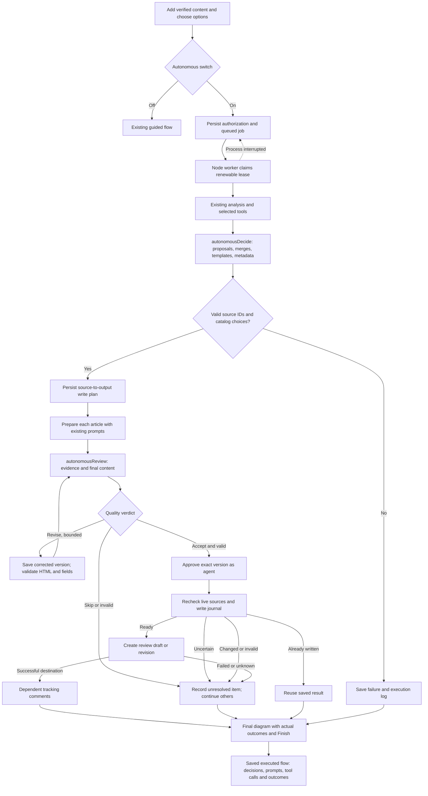

# Autonomous pipeline

The first-step switch is off by default. Turning it on authorizes the agent to make the plan, merge and metadata choices, prepare and review articles, then create **review drafts/revisions** and dependent merge comments. Nothing is published or deleted. The final page shows the existing source → action → result diagram with actual outcomes and a Finish button.

The current OpenAI models and provider remain unchanged. `autonomousDecide` and `autonomousReview` use the existing reasoning tier. There is no Anthropic dependency, Vercel Workflow, Queue, Cron, or Vercel-specific execution function.

## Run it

1. Use Node 22 and install this repository's dependencies with `npm ci` (the worker uses `tsx` from devDependencies).
2. Configure the existing `OPENAI_API_KEY` and RightAnswers variables from `.env.example`. Keep secrets server-side.
3. App and worker must share the **same database**. For an app already hosted remotely, use its existing `TURSO_DATABASE_URL` and `TURSO_AUTH_TOKEN` on the worker. A self-hosted app and worker can instead share the same absolute `KS_DB_PATH` on a persistent disk.
4. Set `KS_AUTONOMOUS_ENABLED=true` on both processes. Restart the app after changing its environment.
5. Run `npm run worker` from the repository. This process can run locally or on any Node host you control. It needs no Vercel account. On the corporate network, use `NODE_EXTRA_CA_CERTS=./certs/corporate-ca.pem npm run worker`.
6. In the first step, turn on **Run fully autonomously** and click **Start autonomous run**. Inspect live activity, or close the tab and return via its saved link or **Explore engine flow → Past executions**.

The worker reads `.env`; it does not automatically read Next.js `.env.local`. Environment variables supplied by the host take precedence. `npm run worker -- --once` handles one queued job and exits (or exits immediately when no job is queued). Use a process supervisor with automatic restart on a persistent host for continuous operation. Shutting down the worker's computer pauses processing. The app clearly reports when no worker heartbeat is available.

Existing Next.js endpoints continue to serve the app. `/api/autonomous` only enqueues or reads database state; it never performs a long AI pipeline. A browser polling error does not cancel the worker. A repeated start request with the same request ID and payload returns the same run.

## Boundaries and recovery

- Tables: `autonomous_jobs`, `autonomous_events`, `autonomous_checkpoints`, `autonomous_workers`. All changes are additive. Guided resume/discard and submission endpoints exclude autonomous jobs.
- A database transaction grants a five-minute execution lease. The worker renews it every 15 seconds. Expired leases can be claimed after process loss. The existing write lock also applies; its expiry may delay recovery up to 15 minutes after an abrupt crash.
- Completed analysis reads/model results and stage decisions are checkpointed. Preparation and submission reuse the existing durable write journal. A crash between receiving a model response and saving it can cause another model call; this is not exactly-once model billing.
- Every agent decision includes a concise explanation and source evidence. These are explicit decision summaries, not private chain-of-thought. Every approval records the agent, policy version and exact prepared version.
- Quality review has at most three rounds per article. Corrections use available source evidence, exact template fields, HTML body fields, and plain-text summary/keywords. A corrected version must pass validation and another quality review before any write.
- Invalid decisions, unknown IDs or metadata stop the run before writing. Unsupported/conflicted articles remain unresolved while independent valid articles can proceed. Source versions are checked again before writes.
- Completed writes are never resent. Lost/uncertain write responses are not automatically retried: verify those outcomes in RightAnswers before starting work that could duplicate them. Tracking comments wait for the retained article's successful write. No auto-retry action is exposed for terminal partial runs.
- The finished graph distinguishes prepared content from articles actually submitted. Partial runs retain successful outputs and reasons for each unresolved item. There is no second Submit button on autonomous results.
- Turning the feature flag off hides new autonomous starts. Existing authorized work and historical records remain accessible; stop the worker to pause its queue. The guided flow remains available.

## Logs and explorer

The Explorer includes a hypothetical autonomous tree and real saved execution history. The final run page has **Open executed engine flow**. Stage progress, model requests/responses, RA calls and HTTP attempts, read-cache reuse, agent decisions, validation failures and write outcomes are stored in `autonomous_events`. Request and response events share a correlation ID. HTTP completion records include their actual status code; a received 503 response is not a successful application operation.

Polling returns event summaries in pages of 100. **Load more activity** exposes older backlog; selecting an event loads its full input/output. Model prompts and source documents are private to the run's owner. Authentication headers and the RA login response token are omitted from logs. No log retention/deletion job is installed: recorded source content remains in the existing database until its owner implements a retention policy.

## Implementation / acceptance checklist

- [x] Isolated opt-in, queue, authorization and owner-checked APIs.
- [x] Portable Node worker with lease/heartbeat and durable stage checkpoints.
- [x] Existing analysis engine and models; agent plan/metadata choices validated server-side.
- [x] Template-aware preparation, bounded agent review, exact-version approval and existing write journal.
- [x] Completed/partial final diagram, Finish, permanent link and persisted decision/call logs.
- [x] Existing guided regression tests plus autonomous queue, API, review, restart and write tests.
- [ ] Operator starts a worker connected to the deployment database and enables the switch on the deployed app.
- [ ] Live acceptance with intentionally supplied source material and the desired RightAnswers review collection.

These last two checks require the chosen worker host and a real opt-in run; local contract tests do not claim a live production submission.

