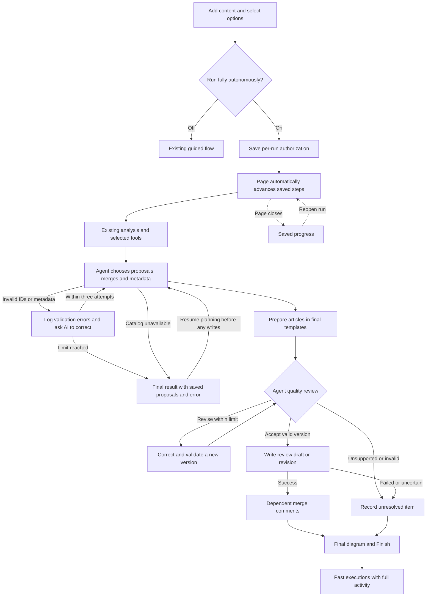

# Autonomous pipeline

Choose the run type on the first screen, every time:

- **Run fully autonomously off**: use the existing guided flow.
- **Run fully autonomously on**: click **Start autonomous run**. The agent plans, chooses merges/templates/metadata, prepares and checks the articles, then creates RightAnswers review drafts/revisions and dependent merge comments. The final screen shows the source → action → result diagram, actual outcomes and **Finish**.

The switch is always available and starts off for a new run. There is no new environment variable, terminal command, separate worker, or orchestration service to configure. Existing models, credentials and database are reused. No Anthropic migration is involved.

Keep the execution page open while the prototype runs. The browser automatically requests the next saved step; it does not make editorial choices itself. If the page closes, the active request may finish, but subsequent steps wait until the user reopens the saved run. The page and **Past executions** provide permanent links. A repeated start with the same request ID returns the same run.

## Execution and recovery

`POST /api/autonomous` persists the explicit per-run authorization. The run page automatically calls `POST /api/autonomous/advance`. Each authenticated request processes a saved unit of work: analysis, plan decisions, one article preparation, one quality round, or one write. Status and events are read separately so progress remains visible while the step runs. No long-running work is detached from the request.

The existing backend's request limits still apply to individual steps, especially a large analysis. Interrupted requests can be retried using saved reads and checkpoints; successful or uncertain writes are never blindly replayed. This is a prototype driven by the open page, not an unattended scheduler.

- Tables: `autonomous_jobs`, `autonomous_events`, `autonomous_checkpoints`. Guided resume/discard and submission APIs exclude autonomous jobs.
- A transaction claims only the requested run. A 60-second lease and run lock prevent duplicate work from simultaneous tabs. The request renews its lease every 15 seconds and releases it on completion; an abruptly interrupted request expires automatically. Guided lock behavior is unchanged.
- Analysis reads/model results and decisions are checkpointed. Exact prompts, including their random data delimiters, remain logged; cache identity uses stable source content and prompt version. A crash before saving a model result can still repeat that model call.
- Planning constrains evidence IDs, template names and metadata to the actual run/catalog. The collection must be a catalog code: choosing it for new articles is an editorial decision, while revisions preserve their parent's metadata. A rejected plan receives the precise validation errors and its prior output for correction, up to three saved attempts across requests. The analysis is reused, and every rejected attempt remains in the Explorer. Exhausting this limit disables Resume planning for that planner version.
- Quality review allows at most three rounds per article across resumptions. Corrections must preserve supported facts, template field names, HTML body fields, and plain-text summary/keywords. A changed version must be reviewed again.
- Agent approvals record the exact prepared version, policy version, explanation and source evidence. Invalid IDs, unsupported claims or unresolved conflicts cannot authorize writes. Independent valid articles can proceed while unresolved articles remain visible.
- Live source versions are checked again before writes. New articles use review status; published parents get revisions. Tracking comments wait for a successful retained destination. Nothing is published, deleted or archived.
- Completed writes are reused. An uncertain response stays blocked for verification in RightAnswers. Terminal partial runs do not expose an automatic resend button.
- The final graph distinguishes prepared drafts from actual submissions. Finish returns to content with the switch off. Saved executions remain available later.

## Explorer and logs

**Open executed engine flow** opens the saved graph and activity. The Explorer also includes a hypothetical autonomous tree and downloadable [Mermaid tree](knowledge-studio-autonomous-flow.mmd).

Stage progress, model requests/responses, RA calls and HTTP attempts, cache reuse, agent decision explanations, validation failures and write outcomes are persisted. Explanations are evidence-based decision summaries, not private chain-of-thought. Request/response events share a correlation ID.

The activity list loads summaries in pages of 100. Selecting an event retrieves its full input/output. Access is scoped to the run owner; authentication headers and the RA login token are omitted. HTTP transport completion includes its actual status code and does not imply application success.

Every terminal run also shows an execution result: recorded stage progress, the failure stage and message, saved proposals, and actual prepared/submitted article counts. This appears on the run screen and in past executions even when failure occurred before a submission plan existed. Older saved histories are backfilled when opened; proposals are never presented as created articles.

If analysis succeeded but planning stopped before a decision snapshot or any write state, **Resume planning** reuses that analysis. This explicit action is owner-scoped, retains the original error/activity, and resumes the original authorization. Completed/partial runs, runs with write attempts, and obsolete authorizations cannot use it. The autonomous catalog uses the same `taxonomies,languages` facet request as guided Metadata; the pilot RA server rejects the languages-only request.

