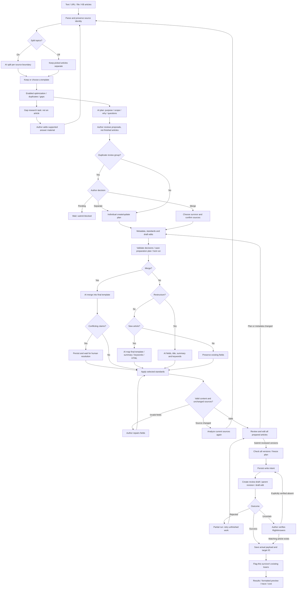

# Engine and explorer guide

Open `/flow`, or click **Explore engine flow** in the wizard. Sources and operation controls update active branches immediately. Other paths remain visible unless **Show selected path only** is enabled. Click any AI node to inspect its production prompt builder's system message, operator task, illustrative input and output schema. Download the scenario as Mermaid or print/save a PDF.

Outcome controls are scenarios, not predictions. Selecting “high overlap” does not run a search. Example source text changes only the displayed prompt; it never spends tokens or writes content.

Click **Open executed engine flow** on a run’s Check or submission results, or select an item in **Past executions** at `/flow`. The executed view opens automatically and shows the persisted sources/options, completed analysis steps, exact AI calls, saved author decisions, frozen submission options, planned writes and actual outcomes. Each run has a permanent link and its own Mermaid export.

Snapshots are stored in the `flow_executions` table after analysis and submission and updated after reconciliation. Earlier runs are backfilled from saved records on first access. Completed trees retain their saved representation; open or partial runs refresh from current records. History is paginated and limited to the authenticated author, including failed/discarded runs. It makes no AI calls and cannot repeat writes. Tool steps and model calls are recorded separately; the explorer does not pretend every underlying API read has its own event.

In scenario mode, **Load / refresh recorded activity** also reads actual authenticated AI calls. Expand each to see exact requests, responses, models, tokens and estimated costs. Refresh after submission to include merging, restructuring and standards.

## Planning before authoring

Analysis ends with the `plan` prompt (reasoning model): source text, selected operations, completed tool steps, warnings and duplicate evidence become one structured proposal per topic. It runs even with all optional operations off. The engine chooses tools from the enabled options; the planner synthesizes their evidence and cannot invoke write tools or enable unchecked options. It describes purpose, coverage, rationale and verification questions, without writing article fields. Template selection during analysis is a suggestion for new articles; Metadata determines the final template.

Check shows these proposals and the actual source labels. Duplicate evidence is separate from the overall rationale; disabled detection says “Not checked.” Merge suggestions still require a human decision. Old saved runs show a notice to analyze again to obtain detailed proposals.

Approved scope accompanies source evidence into restructure/merge when the author clicks **Prepare drafts** after Metadata. Plans are guidance, not factual sources; edited content and final templates take precedence. With restructuring disabled, existing articles retain their fields. New articles still run `compose`: map source wording into every relevant final-template field, generate summary and keywords, and format as HTML without stylistic rewriting. Final article previews appear before submission, with title, summary, keywords and every final-template field. **Submit reviewed drafts** sends the reviewed preparation without rerunning the authoring prompts. Every planning call is included in the recorded trace and cost.

## Duplicate detection, step by step

1. Enable a content source and **Find duplicates**. Set two or more topics to explore within-batch comparison.
2. **Generate retrieval queries** uses `dedupeQuery`: title and full topic body → a focused task query (3–8 terms) and a broad product/protocol/error query (1–3 terms). Titles alone do not drive retrieval.
3. **Search RightAnswers** combines Hybrid search for the task, one Keyword page for the broad query, and lower-weight Neural results. Reciprocal-rank fusion weights Hybrid/Keyword equally and Neural at 0.25, with a rank constant of 60. Keep at most six unique eligible results per engine, excluding picked source IDs. Deduplicate across engines; up to 16 full articles are fetched and cached. Generated searches do not enter user search history. The executed flow records each query, returned IDs, compared IDs and limits. These are bounded searches within the author’s access, not an exhaustive scan of the KB. A failed search stops analysis instead of reporting no duplicates.
4. With no neighbours, external adjudication is skipped. Otherwise `dedupeAdjudicate` reads full articles in batches of four, with at most two calls in parallel. The response schema requires one verdict per application-assigned slot, including distinct articles. Server code maps slots to the original IDs; article text cannot replace them. Invalid structured output retries once for that batch; a second failure stops analysis with an explicit incomplete-check message.
5. Duplicate means the same problem AND resolution. Overlapping means shared coverage plus unique details. Shared vocabulary alone is distinct. The 0–100 score is model judgment, not a calibrated probability or an RA relevance score.
6. Multiple proposals receive a separate within-batch comparison using the same rubric, detecting content not yet in the KB. Every pair receives a required verdict, including distinct pairs, in batches of 12 comparisons.
7. Links require the same primary reader need AND a score of 80 or above to form connected review groups. Shared background, prerequisites or product terminology alone do not qualify. The default survivor prefers an existing article, then the highest view count. Groups can be transitive; the human decides whether to merge.
8. At Check, deselect candidates, keep groups separate, or choose a survivor and confirm. Unresolved selected groups block submission on the server too.
9. Keeping separate plans individual creates/updates. Merging plans a survivor write plus comments for existing losers. Deselected owned candidates contribute no content.
10. The merge prompt runs on Prepare drafts against current sources and the final template. Conflicts and contributions persist. Incompatible claims pause the affected article for a human choice or edit.
11. Selected standards apply after resolution, to merged and ordinary articles. Exact template fields, required/nonempty content and HTML must validate.
12. A survivor's success unlocks its own loser comments, pointing to the actual retained ID. Other groups can finish independently. Nothing is archived; analytics do not migrate.

## End-to-end diagram

[Full Mermaid tree](knowledge-studio-flow.mmd). The interactive explorer adds no-content paths, disabled options, retrieval failures, field review and detailed backend behavior.

## Source and title policies

- Fresh pasted/uploaded/fetched material can split together. Each picked existing article is processed separately; output order never determines a write target.
- One topic from an existing source retains its update target and template. Several topics create new drafts and leave the original intact. Every topic keeps source provenance.
- Original HTML fields are retained for existing articles' non-restructure path; source Markdown is used for AI analysis. Disabling restructuring does not write Markdown back as HTML.
- Template-choice AI runs for new drafts only when restructuring is on, no template is fixed, and multiple eligible templates exist. Metadata overrides determine the final authoring template.
- User-edited/optimized titles override later generated titles. Summaries and keywords survive the final write; optimized keywords are retained.
- Language is classification, not an implicit translation request.

## Review and recovery

Preparation saves a mutable plan and persists each draft independently. Changing the plan before submission invalidates its prepared drafts. Submission checks every reviewed version before the first possible write and then freezes the plan. For a different plan afterward, start a new run. Retrying cannot silently change work already written.

Conflicts and validation errors persist as prepared content. Review shows competing versions, editable fields and unmapped-content warnings. Save and validate edits with Prepare drafts. This creates a new review version; submission consumes that exact version without regenerating the merge. Missing required facts need human-supported content, not invention.

The Sources → Actions → Results graph counts actual output articles, includes external survivors and displays tracking comments separately. It remains available in Past executions. Each write is journaled before HTTP transmission. No automatic non-idempotent POST retries occur. Saved successes return without another write; a durable run lock serializes concurrent submissions.

After a lost response, the outcome is uncertain, not failed. Check RightAnswers. Either supply the actual draft/revision ID (the server verifies its content) or explicitly verify the write did not occur before permitting a retry. For comments, the author checks the internal comment. No automatic duplicate-prone resend occurs.

Unrelated pending revisions are not overwritten automatically. Resolve/select the pending draft in RightAnswers first. Source changes since analysis/preparation require a new analysis.

Each group's flags depend on its own survivor. Prepared fields, outcomes and partial runs survive reload. Prompt traces and estimates include analysis and submission; estimates cannot reconcile external failures without reported token usage against billing.

## Verification boundaries

Contract tests use mocked services and temporary databases. They verify data flow, gates, retries, persistence, prompt construction and payloads, not every model's factual output or the live availability/pricing of configured models. The prepare/review boundary and graph are covered by route, engine and server-rendering tests. The duplicate-detection correction was additionally checked against live read-only RA retrieval and paid model comparisons of known MCP duplicates. No RA writes were made during those checks. Publication remains in RightAnswers' approval workflow.

## Article structure and HTML

Final previews show saved title, summary, keywords, template name and every field in template order, including fields with no content. Empty optional fields remain empty when the source does not support them; they are not filled with invented facts. Merge authoring also supplies summary and keywords.

Authoring and standards prompts explicitly require HTML field values. Markdown source is converted with Marked and sanitized before writes. Validation rejects Markdown left inside HTML prose, preventing literal heading/list/code syntax from silently reaching Solution Manager. Plain metadata (title, summary, keywords) stays plain text.

An unwritten new article paused for review can be regenerated from its saved source with a newly selected template. Regeneration validates the saved review version and performs no writes. The author reviews the new preparation before submitting; successful prior writes remain unchanged.

## Optional autonomous mode

The guided flow above remains the default. The first-step autonomous switch delegates plan, merge and metadata choices and final quality review to the existing AI models. The app automatically advances saved steps to create approved review drafts/revisions, logs explicit decision explanations and tool/model inputs and outputs, and ends on the same result graph. See [Autonomous pipeline](autonomous-pipeline.md) for setup, recovery boundaries and the full flow tree. No Vercel orchestration service or provider migration is required.

## Ordered visual sources

The content editor stores a sequence of text blocks and attachment references. Images and documents are inserted at the cursor immediately, so parallel upload completion cannot reorder them. Original PNG, JPEG and WebP images are stored in authenticated, chunked database records and displayed inline. PDFs, Word and text documents expose their parsed text in a card at the insertion point.

Analysis, article preparation and autonomous review send original image bytes interleaved with neighbouring source text to the model. Image ingestion itself does not transcribe the image. Run history saves the editor sequence and image references; previews require the same author account. Model audit entries reference the durable image IDs instead of repeating base64 payloads. Historical uploads that only saved a transcription must be reinserted to recover visual context.
