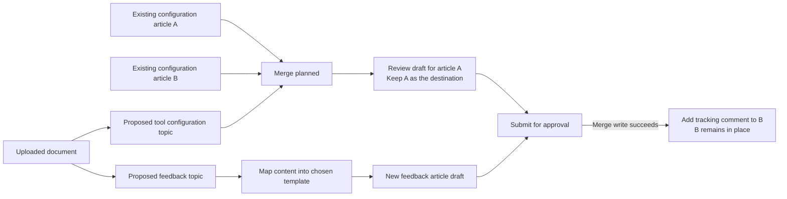

# Proposed submission review

Status: design proposal. The graph and draft preparation workflow below are not implemented yet. The six-result retrieval limit and clearer merge labels are separate changes.

The current screen lists selected proposals rather than the actual operations from `buildWritePlan`. When an existing KB article is the merge destination, it can be absent from the list entirely. Editing a row opens only that proposal's source material, not the combined article. Counting these rows as output solutions is misleading.

## Recommended screen

Use a wide canvas with three columns: **Sources → Planned actions → Resulting articles**. A persistent right-hand panel displays the selected node's details. Keep the regular app header and stepper, including the actual proposal count. Provide Graph / List views, fit-to-screen, zoom, keyboard-accessible node selection and a legend. Color is supplementary to text/icons.

The summary counts final new articles, revised articles, merge groups and source articles receiving tracking comments separately. Multiple proposals contributing to one destination count as one output article. The graph is built from the same `buildWritePlan` output as submission, including external survivors, unselected-source exclusions and internal tracking comments; it must not independently infer a plan from badge counts.

This is an illustration, not an assertion about the exact number or identity of articles in the screenshot. Split-topic provenance stays visible. A new proposal absorbed into a merge is never depicted as a stored article requiring a comment.

## Selecting nodes

| Node | Details and available actions |
| --- | --- |
| Source | Title, real ID if existing, source type, template and original fields. Read-only source preview. A proposal is explicitly marked as not yet created. |
| Merge | All included sources, destination ID/title, duplicate rationale, similarity evidence, planned coverage and open questions. Link back to Check to change the survivor or keep separate. No single-source textarea masquerading as a combined article. |
| Restructure / format | Selected authoring options and final template. Explain how source content will be mapped into fields. Existing destinations retain their current template under the current engine rules. |
| Result | Planned scope before preparation; complete title, summary, keywords and every template field after preparation. Render HTML content as HTML. Show source contributions and any unresolved conflicts. |
| Tracking comment | Existing source and retained destination, dependency on a successful merge, and eventual write status. No implied deletion, archival or transfer of analytics. |

The main view uses author-facing explanations. An **Engine details** disclosure provides prompt name/version, actual calls, input/output and timing when available. The existing engine explorer remains accessible for the full recorded trace.

## Prepare, review, then submit

Keep Content and Check as planning. After Metadata fixes the template and authoring options, the final step first offers **Prepare drafts**. This runs the authoring prompts against all relevant sources and persists prepared drafts without writing to RightAnswers. The user can then inspect the real combined article and its full structure before **Submit for review** writes it.

This requires separating the current submission preparation from execution. It is not just a new preview component. Reuse the existing preparation, conflict resolution, validation and write journal logic; do not introduce a second authoring implementation. Submission must consume the exact reviewed preparation, validate source versions and retain successful writes on retry.

Changes to included sources, destination, source material, template or authoring options invalidate affected prepared drafts and require preparing them again. Final-field edits are saved on the prepared draft. Do not silently regenerate approved edits on submission. Missing facts and merge conflicts remain explicit review gates.

If the workflow remains as it is today, label the destination **Planned result — content will be generated on submit** and show only scope, sources and rationale. Do not present source text as the final article.

## Execution states on the same graph

Each action transitions through planned, preparing, needs review, ready, writing, completed, failed or uncertain. State comes from persisted preparation and journal records, not elapsed-time animation. **Merge planned** becomes **Merged** only after the retained article write succeeds. Comment completion is a separate node: a failed comment does not imply a failed merge.

Partial retries target unfinished operations. A lost write response is shown as uncertain and follows the existing reconciliation workflow. The historical graph freezes the plan actually submitted and overlays recorded outcomes. It remains reachable from Past executions.

## Delivery order and acceptance

1. Immediate: keep six eligible results from each of Hybrid, Keyword and Neural, with no second Keyword page; replace “Flagged” wording; identify the current editor as a source editor.
2. Build the graph and accessible list from `buildWritePlan`, with selection details and accurate output counts. Verify external survivors and several proposals merging into one destination.
3. Separate draft preparation from writes, show and edit the actual combined template fields, and enforce invalidation before submission.
4. Overlay execution progress and persist the same graph with operation outcomes for history.

Acceptance cases include new-only creation, update without merge, two new proposals becoming one article, new proposals merging into an external existing survivor, several existing articles merging, deselected sources, unresolved conflicts, partial write success, failed tracking comments and uncertain write outcomes.
